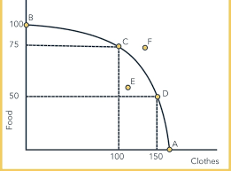

# SS Notes

Economics

* STUDY OF HOW INDIVIDUALS AND SOCIETIES CHOOSE
TO ACQUIRE AND UTILIZE SCARCE RESOURCES

Three Central Problems
in Addressing Scarcity

* What to Produce?
* How to Produce
* When to Produce?

more stuff

* Scarcity
  * In life there is a finite amount of resources.
* Choices
  * The ability to allocate resources in the market
  * The concepts of constrained choice and scarcity are central to the discipline of economics.
  * They can be applied when discussing the behavior of individuals such as Tarzan and when analyzing the behavior of large groups of people in complex societies
  * Choices are the options we have in addressing scarcity and its three problems
* Opportunity cost
  * the loss when you make a choice
* Relationship
  * how things interacts.

Economics as a science

* Uses the scientific method
* Uses deductive and inductive reasoning.
  * Deuctive
  * Inductive

No one should be left behind

Ceteris paribus

* With other things held constant.
* Focus on one situation alone
* Application in susient: law
* To make controlled experiment to get posible situations.
* Make uncontrolled situations to controlled
* Humans are irrational
* Uses Ceteris paribus to Make social science a hard science.
* emotion dictaes our actions.

esse est co esse

* coexist
* to be is to be with
* think of others too

needs and wants

* needs are what is required
* wants are what u want
  * hierarchy bottom to top - need to wants
    1. self actualization
        * Why do I exist.
    2. esteam
    3. love
    4. safety
    5. physiological

* This is not consistent to person to person.
* Needs and desires depends on the lifestyle
* the interaction with other people motivates the needs and desires
* needs and disire are shaped by Scarcity and oppertunity costs

We are all economic agent

* human who acts on needs and desires.
  * even school shooters
    * the quiet kid
    * they want to be heard so they do the bad thing to be heard
* agents should be rational for economics or less everything will be chaos
* being too rational will be loose our use our humanity
  * it is argued that death penalty is too rational.
    * every person deserves second change but with conditons
* being rational should be balanced with irrationalty.

ss grade 9 is what if

optimal economic behavior

* economist think this bad
* why?
* your acting on your self interest
* companies maximize gains
* they fire people but on for themselves so bad
* wheneveryone optimal economic behavior "optimal chaos" or smth i forgor

production posiblilities frontier

* making
* can happen
* limit
* shows maximum possible output combinations.

part of ppf

* only 2 to simplefly study
* cloth or food
* points of curves are optimized
* untill 100 to because maximum out put.
* if point is outside graph
* point f is posible but still not posible
* like inproving stuff
* point e is bad bec less resourses
* point e regress
* e is not maximies not using resourses well
* e bad but i like letter e
* point e is maximum if resourses decrease.
* opertunity cost
  * if you select d less of food
  * if point e not maximize and did not select better options.
* choose where point in curve based on the nations wants

economics consedes that even if its desireable it has reporcutions
ppf shows that no choose is better or worse

we should not be fully rational.
